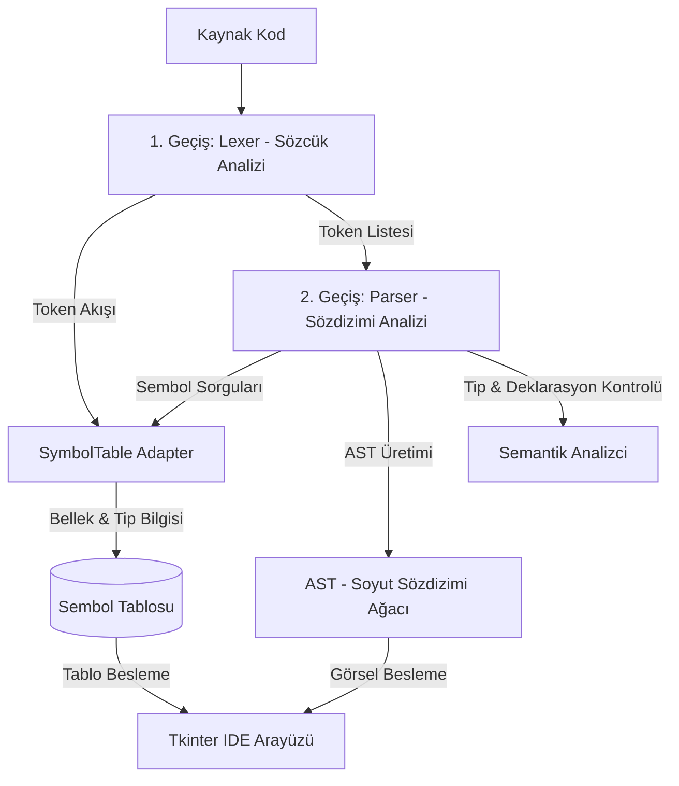

# Derleyici Projesi Teknik Raporu (Compiler Project Report)

Bu rapor, geliştirilen C-benzeri programlama dili derleyicisinin sistem tasarımı, mimarisi, gramer tanımları, bileşenleri, hata yönetim stratejileri ve kullanıcı arayüzü (UI) detaylarını içermektedir.

---

## 1. Sistem Tasarımı ve Mimari Genel Bakış (System Design & Architecture)

Derleyici, çok katmanlı ve iki geçişli (two-pass) bir mimariye sahiptir. İki öğrencinin ortak çalışmasını birleştiren ve görsel bir IDE ile desteklenen yapısı aşağıdaki gibi şematize edilebilir:



Derleme süreci iki temel aşamadan oluşur:
1. **Pass 1 (Sözcük Analizi):** Kaynak kod karakter karakter okunarak anlamlı belirteçlere (Token) dönüştürülür.
2. **Pass 2 (Sözdizimi ve Semantik Analiz):** Token akışı hiyerarşik bir ağaç yapısına (AST) dönüştürülürken, aynı zamanda değişkenlerin doğru tanımlanıp tanımlanmadığı ve tip uyumluluğu denetlenir.

---

## 2. Kaynak Dilin BNF Gramer Tanımı (BNF Grammar Definition)

Dilin sözdizim kuralları, **sol-birleşmeli aritmetik işlemler** ve **opsiyonel değişken atamaları** dahil olmak üzere en güncel haliyle aşağıdaki BNF (Backus-Naur Form) kuralları ile tanımlanmıştır:

```bnf
<program> ::= <statement_list>

<statement_list> ::= <statement> <statement_list>
                   | ""

<statement> ::= <var_declaration> 
              | <assignment> 
              | <if_statement> 
              | <while_statement> 
              | <print_statement>

<block> ::= "{" <statement_list> "}"

Variable Definition and Assignment
<var_declaration> ::= <type> <identifier> ";"
                    | <type> <identifier> "=" <expression> ";"
<type> ::= "int" | "float"

<assignment> ::= <identifier> "=" <expression> ";"

Control Structures
<if_statement> ::= "if" "(" <expression> ")" <block> 
                 | "if" "(" <expression> ")" <block> "else" <block>

<while_statement> ::= "while" "(" <expression> ")" <block>

<print_statement> ::= "print" "(" <expression> ")" ";"

Mathematical Expressions and Numbers
<expression> ::= <arithmetic_expr> 
               | <arithmetic_expr> <relational_op> <arithmetic_expr>

<arithmetic_expr> ::= <arithmetic_expr> <add_op> <term>
                    | <term>

<term> ::= <term> <mult_op> <factor>
         | <factor>

<factor> ::= <identifier> 
           | <number>
           | <string_literal>

<relational_op> ::= ">" | "<" | "==" | ">=" | "<=" | "!="
<add_op> ::= "+" | "-"
<mult_op> ::= "*" | "/"

<identifier> ::= [a-zA-Z_][a-zA-Z0-9_]*
<number> ::= [0-9]+ 
           | [0-9]+ "." [0-9]+
<string_literal> ::= '"' [Herhangi Karakterler] '"'
```

---

## 3. Sözcük Analizcisi Gerçeklemesi (Lexer Implementation - Pass 1)

`src/lexer/lexer.py` içerisinde tanımlanan **Lexer** sınıfı, kaynak kodu baştan sona analiz ederek tokenlara ayırır.

### Token Tipleri (TokenType)
Derleyici tarafından tanınan belirteç tipleri şunlardır:
* `KEYWORD`: `int`, `float`, `if`, `else`, `while`, `print`
* `IDENTIFIER`: Harf veya alt çizgi ile başlayan değişken adları.
* `INTEGER_LITERAL` & `FLOAT_LITERAL`: Sayısal değerler.
* `STRING_LITERAL`: Çift tırnak içerisindeki metinler.
* `OPERATOR`: Matematiksel ve mantıksal işlemler (`+`, `-`, `*`, `/`, `=`, `>`, `<`, `==` vb.).
* `DELIMITER`: Blok ve sınır belirleyiciler (`;`, `(`, `)`, `{`, `}`).

### Sözcük Analiz Algoritması
Lexer, karakter akışını kontrol etmek için `current_char()`, `peek()` ve `advance()` metotlarını kullanır.
* Sayılar, float değerleri saptamak için isteğe bağlı bir nokta (`.`) kontrolü içeren `read_number()` fonksiyonu ile okunur.
* Kelimeler `read_word()` fonksiyonu ile okunur; kelimenin anahtar kelime kümesinde olup olmadığına bakılarak `KEYWORD` veya `IDENTIFIER` olduğuna karar verilir.
* String ifadeler `read_string()` ile okunur; tırnağın kapatılmaması veya satır sonuna gelinmesi durumunda lexical hata kaydı tutulur.

---

## 4. Sözdizimi ve Semantik Analizci Gerçeklemesi (Parser & Semantic Analyzer - Pass 2)

`src/parser/parser.py` içerisinde tanımlanan **Parser** sınıfı, özyinelemeli iniş (Recursive Descent Parsing) tekniğini kullanır.

### Soyut Sözdizimi Ağacı (AST) Düğümleri
Derleyici, sözdizimi başarıyla tamamlanan her ifadeyi `src/parser/ast_nodes.py` içindeki özel sınıflar aracılığıyla ağaçlandırır:
* `ProgramNode`: Tüm program ifadelerini barındıran kök düğüm.
* `VariableDeclarationNode`: Değişken tanımlamalarını (opsiyonel değer atamalarıyla birlikte) temsil eder.
* `AssignmentNode`: Değişkenlere yapılan atamaları temsil eder.
* `LiteralNode`: Ham değerleri (sayı, string vb.) tutar.
* `BinOpNode`: İkili işlemleri ağaçlandırır.
* `IfNode` & `WhileNode`: Kontrol yapılarını ve içlerindeki kod bloklarını barındırır.
* `PrintNode`: Ekrana yazdırma fonksiyonunu temsil eder.

### Semantik Kontroller (Semantic Checks)
`src/parser/semantic.py` dosyasındaki **SemanticAnalyzer** sınıfı derleme anında şu mantıksal denetimleri yapar:
1. **Değişken Deklarasyon Kontrolü (`check_variable_declared`):** Bir değişken tanımlanmadan atama veya işlemlerde kullanılamaz.
2. **Tip Uyuşmazlığı Kontrolü (`check_type_mismatch`):**
   * `int` tipindeki bir değişkene `float` veya `string` atanamaz.
   * `float` tipindeki bir değişkene geçerli sayısal değerler dışı (örn. `string`) değerler atanamaz.
3. **Mükerrer Tanımlama Kontrolü:** Aynı değişken adı aynı blok/skop düzeyinde birden fazla kez tanımlanamaz (Sembol tablosu düzeyinde kontrol edilir).

---

## 5. Sembol Tablosu Yapısı ve Yönetimi (Symbol Table Structure)

Sembol tablosu, derleme boyunca değişkenlerin ad, tip, line ve bellek adres bilgilerini saklar. 

* **Gerçekleme (`src/lexer/symbol_table.py`):** `SymbolTable` sınıfı, sembolleri hash tablosu yapısında saklar. Eklenen her yeni değişken için otomatik olarak benzersiz bir bellek adresi (örn. 4'er baytlık artışlarla `0x000`, `0x004`, `0x008` şeklinde) tahsis eder.
* **Köprü Tasarım Deseni (Adapter Pattern - `src/main.py`):** 1. Öğrencinin yazdığı nesne tabanlı sembol tablosu ile 2. Öğrencinin yazdığı sözlük (dict) bekleyen parser yapısı, `SymbolTableAdapter` sınıfı aracılığıyla birbirine bağlanmıştır. Bu sayede iki farklı öğrenci kodunun kusursuz bir şekilde entegre olması sağlanmıştır.

---

## 6. Hata Yönetim Stratejisi (Error Handling)

Derleyici, kullanıcının yaptığı hataları 3 farklı aşamada yakalar ve detaylı hata raporları sunar:

1. **Sözcük Hataları (Lexer Errors):** Kaynak kodda geçersiz bir karakter (örn: `@`, `#`) saptandığında veya tırnak işareti kapatılmadığında bu durumlar satır numaralarıyla birlikte `lexer.errors` listesinde toplanır ve derleme güvenli şekilde durdurulur.
2. **Sözdizimi Hataları (Syntax Errors):** Kodun gramer kurallarına uymadığı durumlarda (örn: `if (x > )` veya eksik noktalı virgül `;`), parser tarafından `SyntaxErrorCustom` istisnası fırlatılır. Hata mesajında hangi satırda neyin beklendiği ve gerçekte ne geldiği açıkça belirtilir.
3. **Anlam Bilgisi Hataları (Semantic Errors):** Tip uyumsuzluklarında veya tanımlanmamış değişken kullanımlarında `SemanticError` fırlatılır. Hatanın satır numarası ve sebebi konsola yazdırılır.

---

## 7. Kullanıcı Arayüzü Ekran Görüntüleri ve Mantığı (UI & Logic Explanation)

Geliştirilen modern koyu temalı görsel IDE arayüzü (`src/ui/ui.py`), Tkinter kütüphanesi kullanılarak tasarlanmıştır.

### Arayüz Mantığı ve Bileşenleri
* **Kod Editörü (Sol Panel):** Kullanıcının kod yazabileceği alan. Kelimeleri dinamik renklendiren sözdizimi boyayıcısına ve satır numaralarını gösteren entegre bir yan çubuğa sahiptir.
* **Çıktı Konsolu (Alt Panel):** Derleme adımlarını adım adım gösterir. Başarılı sonuçları yeşil, hata çıktılarını ise kırmızı renk kodlarıyla anlaşılır biçimde raporlar.
* **Analiz Sekmeleri (Sağ Panel):**
  * **AST Görseli:** Derleme başarılı olduğunda üretilen JSON ağaç yapısını interaktif görüntüler.
  * **Sembol Tablosu:** Bellek adresleri ve veri tipleriyle birlikte aktif değişken listesini görüntüler.
  * **Token Tablosu:** Lexer'ın ürettiği tüm geçerli belirteçlerin tam dökümünü çıkarır.

---

## 8. Karşılaşılan Zorluklar ve Çözümler (Challenges & Solutions)

### Zorluk 1: Öğrenci Kodlarının Mismatch (Uyuşmazlık) Sorunu
* **Açıklama:** Sözcük analizcisini yazan öğrenci ile sözdizimi analizcisini yazan öğrencinin veri yapıları (sembol tablosu sorguları ve token formatları) birbiriyle uyumsuzdu.
* **Çözüm:** `main.py` içerisine `SymbolTableAdapter` yazılarak aradaki arayüz uyuşmazlığı giderildi. Tokenlar parser'ın beklediği esnek sözlük formatına otomatik dönüştürüldü.

### Zorluk 2: Değişken Tanımlama Anında Değer Atama Desteği
* **Açıklama:** Başlangıçta derleyici yalnızca `int x; x = 10;` şeklinde iki ayrı satırda atamaya izin veriyordu. Tek satırda `int x = 10;` yazımı hata veriyordu.
* **Çözüm:** Gramer (BNF) güncellendi, `ast_nodes.py` içerisindeki deklarasyon düğümüne `initial_value` parametresi eklendi ve `parser.py` içerisindeki `parse_var_declaration` fonksiyonuna isteğe bağlı `=` kontrolü ve semantik tip analizi entegre edilerek bu özellik başarıyla dile kazandırıldı.

### Zorluk 3: Terminal Unicode Hataları
* **Açıklama:** Windows terminalinin yerel karakter kodlaması (CP1254/Turkish) nedeniyle emoji ve bazı Türkçe karakterler yazdırılırken `UnicodeEncodeError` hatası alınıyordu.
* **Çözüm:** Arayüz loglarında ve hata konsolunda karakter kodlamaları güvenli biçimlere dönüştürülerek stabil çalışma sağlandı.

---

### Sonuç
Bu proje, teorik derleyici kurallarının (Sözcük analizi, Sentaks analizi, Semantik analiz ve Sembol Yönetimi) pratik bir uygulama üzerinde başarıyla birleştirildiğini ve zengin bir görsel kullanıcı arayüzü (IDE) ile son kullanıcıya sunulduğunu kanıtlamaktadır.
